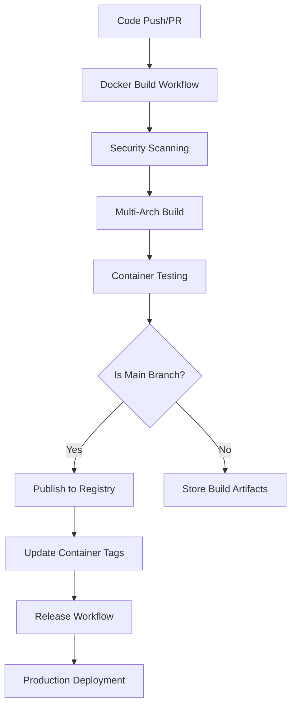

# Docker CI/CD Documentation for ProxmoxMCP

*Comprehensive guide for Docker-related CI/CD workflows, container building, security scanning, and automated deployment processes.*

## Table of Contents

- [Workflow Overview](#workflow-overview)
- [Docker Build Pipeline](#docker-build-pipeline)
- [Security Scanning](#security-scanning)
- [Multi-Architecture Builds](#multi-architecture-builds)
- [Release Process](#release-process)
- [Container Testing](#container-testing)
- [Registry Management](#registry-management)
- [Performance Optimization](#performance-optimization)

---

## Workflow Overview

### CI/CD Architecture

The ProxmoxMCP Docker CI/CD system consists of multiple workflows that handle different aspects of container lifecycle management:



### Workflow Triggers

#### Automated Triggers
- **Pull Requests:** Build and test containers (no publishing)
- **Main Branch:** Build, test, and publish to `:main` tag
- **Release Tags:** Build, test, and publish to `:latest` and version tags
- **Scheduled:** Nightly security scans and dependency updates

#### Manual Triggers
- **Workflow Dispatch:** On-demand builds with custom parameters
- **Emergency Releases:** Hotfix deployments with expedited process

---

## Docker Build Pipeline

### Primary Build Workflow

#### File: `.github/workflows/docker-build.yml`

```yaml
name: Docker Build and Publish

on:
  push:
    branches: 
      - main
      - develop
    tags: 
      - 'v*.*.*'
  pull_request:
    branches: 
      - main
  workflow_dispatch:
    inputs:
      tag:
        description: 'Custom tag for the build'
        required: false
        default: 'manual'
      platforms:
        description: 'Target platforms'
        required: false
        default: 'linux/amd64,linux/arm64'

env:
  REGISTRY: ghcr.io
  IMAGE_NAME: basher83/proxmox-mcp

jobs:
  build:
    runs-on: ubuntu-latest
    permissions:
      contents: read
      packages: write
      security-events: write
    
    steps:
      - name: Checkout code
        uses: actions/checkout@v4
        with:
          fetch-depth: 0  # Full history for proper versioning
      
      - name: Set up Docker Buildx
        uses: docker/setup-buildx-action@v3
        with:
          platforms: ${{ github.event.inputs.platforms || 'linux/amd64,linux/arm64' }}
          driver-opts: |
            image=moby/buildkit:latest
            network=host
      
      - name: Log in to Container Registry
        if: github.event_name != 'pull_request'
        uses: docker/login-action@v3
        with:
          registry: ${{ env.REGISTRY }}
          username: ${{ github.actor }}
          password: ${{ secrets.GITHUB_TOKEN }}
      
      - name: Extract metadata
        id: meta
        uses: docker/metadata-action@v5
        with:
          images: ${{ env.REGISTRY }}/${{ env.IMAGE_NAME }}
          tags: |
            type=ref,event=branch
            type=ref,event=pr
            type=semver,pattern={{version}}
            type=semver,pattern={{major}}.{{minor}}
            type=semver,pattern={{major}}
            type=sha,prefix={{branch}}-
            type=raw,value=latest,enable={{is_default_branch}}
            type=raw,value=${{ github.event.inputs.tag }},enable=${{ github.event_name == 'workflow_dispatch' }}
          labels: |
            org.opencontainers.image.title=ProxmoxMCP
            org.opencontainers.image.description=Model Context Protocol server for Proxmox VE management
            org.opencontainers.image.url=https://github.com/basher83/ProxmoxMCP
            org.opencontainers.image.documentation=https://the-mothership.gitbook.io/proxmox-mcp/
            org.opencontainers.image.source=https://github.com/basher83/ProxmoxMCP
            org.opencontainers.image.vendor=ProxmoxMCP Project
            org.opencontainers.image.licenses=MIT
      
      - name: Build and push
        id: build
        uses: docker/build-push-action@v5
        with:
          context: .
          platforms: ${{ github.event.inputs.platforms || 'linux/amd64,linux/arm64' }}
          push: ${{ github.event_name != 'pull_request' }}
          tags: ${{ steps.meta.outputs.tags }}
          labels: ${{ steps.meta.outputs.labels }}
          cache-from: type=gha
          cache-to: type=gha,mode=max
          build-args: |
            VERSION=${{ steps.meta.outputs.version }}
            GIT_COMMIT=${{ github.sha }}
            BUILD_DATE=${{ steps.meta.outputs.created }}
            MCP_SDK_VERSION=v1.8.0
          provenance: true
          sbom: true
      
      - name: Generate SBOM
        if: github.event_name != 'pull_request'
        uses: anchore/sbom-action@v0
        with:
          image: ${{ env.REGISTRY }}/${{ env.IMAGE_NAME }}:${{ steps.meta.outputs.version }}
          output-file: sbom.spdx.json
          format: spdx-json
      
      - name: Upload SBOM
        if: github.event_name != 'pull_request'
        uses: actions/upload-artifact@v4
        with:
          name: sbom-${{ steps.meta.outputs.version }}
          path: sbom.spdx.json
          retention-days: 30
```

### Build Optimization Features

#### Layer Caching Strategy
```yaml
# Multi-level caching for optimal build performance
- name: Build with advanced caching
  uses: docker/build-push-action@v5
  with:
    cache-from: |
      type=gha,scope=main
      type=gha,scope=${{ github.ref_name }}
      type=registry,ref=${{ env.REGISTRY }}/${{ env.IMAGE_NAME }}:cache
    cache-to: |
      type=gha,scope=${{ github.ref_name }},mode=max
      type=registry,ref=${{ env.REGISTRY }}/${{ env.IMAGE_NAME }}:cache,mode=max
```

#### Dependency Caching
```yaml
# Cache Python dependencies separately
- name: Cache Python dependencies
  uses: actions/cache@v4
  with:
    path: |
      ~/.cache/pip
      .venv
    key: python-deps-${{ hashFiles('**/requirements*.in', '**/pyproject.toml') }}
    restore-keys: |
      python-deps-
```

#### Build Arguments Optimization
```dockerfile
# Dockerfile optimization for CI/CD
ARG BUILDKIT_INLINE_CACHE=1
ARG VERSION=dev
ARG GIT_COMMIT=unknown
ARG BUILD_DATE
ARG MCP_SDK_VERSION=v1.8.0

# Use build arguments effectively
LABEL org.opencontainers.image.version="${VERSION}"
LABEL org.opencontainers.image.revision="${GIT_COMMIT}"
LABEL org.opencontainers.image.created="${BUILD_DATE}"
```

---

## Security Scanning

### Vulnerability Scanning Workflow

#### File: `.github/workflows/container-security.yml`

```yaml
name: Container Security Scanning

on:
  schedule:
    - cron: '0 2 * * *'  # Daily at 2 AM UTC
  workflow_dispatch:
  push:
    branches: [main]
    tags: ['v*.*.*']

jobs:
  security-scan:
    runs-on: ubuntu-latest
    permissions:
      contents: read
      security-events: write
    
    strategy:
      matrix:
        scanner: [trivy, grype, docker-scout]
    
    steps:
      - name: Checkout code
        uses: actions/checkout@v4
      
      - name: Build image for scanning
        uses: docker/build-push-action@v5
        with:
          context: .
          load: true
          tags: proxmox-mcp:scan
          cache-from: type=gha
      
      - name: Run Trivy vulnerability scanner
        if: matrix.scanner == 'trivy'
        uses: aquasecurity/trivy-action@master
        with:
          image-ref: 'proxmox-mcp:scan'
          format: 'sarif'
          output: 'trivy-results.sarif'
          severity: 'CRITICAL,HIGH,MEDIUM'
          exit-code: '0'  # Don't fail the build, just report
          vuln-type: 'os,library'
          scanners: 'vuln,secret,config'
      
      - name: Run Grype vulnerability scanner
        if: matrix.scanner == 'grype'
        uses: anchore/scan-action@v3
        with:
          image: 'proxmox-mcp:scan'
          output-format: sarif
          output-file: grype-results.sarif
          fail-build: false
      
      - name: Run Docker Scout
        if: matrix.scanner == 'docker-scout'
        uses: docker/scout-action@v1
        with:
          command: cves,recommendations,compare
          image: 'proxmox-mcp:scan'
          sarif-file: scout-results.sarif
          write-comment: false
          github-token: ${{ secrets.GITHUB_TOKEN }}
      
      - name: Upload SARIF results
        uses: github/codeql-action/upload-sarif@v3
        if: always()
        with:
          sarif_file: '${{ matrix.scanner }}-results.sarif'
          category: '${{ matrix.scanner }}-container-scan'
      
      - name: Generate security report
        run: |
          echo "## Security Scan Results - ${{ matrix.scanner }}" >> $GITHUB_STEP_SUMMARY
          echo "Scanner: ${{ matrix.scanner }}" >> $GITHUB_STEP_SUMMARY
          echo "Image: proxmox-mcp:scan" >> $GITHUB_STEP_SUMMARY
          echo "Scan Date: $(date)" >> $GITHUB_STEP_SUMMARY
```

### Security Policies

#### Trivy Configuration
```yaml
# .trivyignore - Vulnerability exceptions
# Format: CVE-ID [EXPIRY DATE] [REASON]

# Development dependencies (not in production image)
CVE-2023-12345  2024-12-31  # pytest development dependency
CVE-2023-12346  2024-12-31  # black development dependency

# False positives
CVE-2023-12347  permanent   # False positive in base image
```

#### Security Thresholds
```yaml
# Security quality gates
- name: Check security thresholds
  run: |
    CRITICAL=$(jq '.runs[0].results[] | select(.level=="error") | length' trivy-results.sarif)
    HIGH=$(jq '.runs[0].results[] | select(.level=="warning") | length' trivy-results.sarif)
    
    echo "Critical vulnerabilities: $CRITICAL"
    echo "High vulnerabilities: $HIGH"
    
    if [ "$CRITICAL" -gt 0 ]; then
      echo "❌ Critical vulnerabilities found! Build should not proceed to production."
      exit 1
    fi
    
    if [ "$HIGH" -gt 5 ]; then
      echo "⚠️ Too many high severity vulnerabilities found!"
      exit 1
    fi
```

### Supply Chain Security

#### Container Signing
```yaml
- name: Install cosign
  uses: sigstore/cosign-installer@v3
  with:
    cosign-release: 'v2.2.0'

- name: Sign container image
  run: |
    cosign sign --yes ${{ env.REGISTRY }}/${{ env.IMAGE_NAME }}@${{ steps.build.outputs.digest }}
  env:
    COSIGN_EXPERIMENTAL: 1
```

#### Attestation Generation
```yaml
- name: Generate provenance attestation
  uses: actions/attest-build-provenance@v1
  with:
    subject-name: ${{ env.REGISTRY }}/${{ env.IMAGE_NAME }}
    subject-digest: ${{ steps.build.outputs.digest }}
    push-to-registry: true
```

---

## Multi-Architecture Builds

### Cross-Platform Configuration

#### Build Matrix Strategy
```yaml
strategy:
  matrix:
    platform:
      - linux/amd64
      - linux/arm64
    include:
      - platform: linux/amd64
        arch: amd64
        runner: ubuntu-latest
      - platform: linux/arm64
        arch: arm64
        runner: ubuntu-latest  # Using emulation
        # runner: self-hosted-arm64  # For native ARM builds
```

#### QEMU Emulation Setup
```yaml
- name: Set up QEMU
  uses: docker/setup-qemu-action@v3
  with:
    platforms: arm64,arm
    image: tonistiigi/binfmt:latest

- name: Set up Docker Buildx
  uses: docker/setup-buildx-action@v3
  with:
    platforms: linux/amd64,linux/arm64
    driver-opts: |
      image=moby/buildkit:latest
      network=host
```

### Architecture-Specific Optimizations

#### Conditional Dockerfile Instructions
```dockerfile
# Architecture-specific optimizations
ARG TARGETPLATFORM
ARG TARGETARCH
ARG TARGETVARIANT

# Platform-specific package installations
RUN case "$TARGETARCH" in \
      amd64) \
        echo "Installing AMD64 optimizations"; \
        apt-get update && apt-get install -y intel-mkl; \
        ;; \
      arm64) \
        echo "Installing ARM64 optimizations"; \
        apt-get update && apt-get install -y libblas-dev; \
        ;; \
      *) \
        echo "Generic installation for $TARGETARCH"; \
        ;; \
    esac
```

#### Performance Testing Per Architecture
```yaml
- name: Test container performance
  run: |
    # Performance test script
    docker run --rm --platform ${{ matrix.platform }} \
      proxmox-mcp:test \
      python -c "
    import time
    import platform
    
    start = time.time()
    # Simple performance test
    result = sum(i**2 for i in range(10000))
    end = time.time()
    
    print(f'Platform: {platform.machine()}')
    print(f'Performance test: {end - start:.4f}s')
    print(f'Result: {result}')
    "
```

---

## Release Process

### Automated Release Workflow

#### File: `.github/workflows/release.yml`

```yaml
name: Release

on:
  push:
    tags:
      - 'v*.*.*'
  workflow_dispatch:
    inputs:
      version:
        description: 'Release version (e.g., v1.0.0)'
        required: true
        type: string
      prerelease:
        description: 'Is this a pre-release?'
        required: false
        type: boolean
        default: false

jobs:
  release:
    runs-on: ubuntu-latest
    permissions:
      contents: write
      packages: write
      security-events: write
    
    steps:
      - name: Checkout code
        uses: actions/checkout@v4
        with:
          fetch-depth: 0
      
      - name: Generate changelog
        id: changelog
        uses: conventional-changelog/conventional-changelog-action@v3
        with:
          github-token: ${{ secrets.GITHUB_TOKEN }}
          output-file: 'CHANGELOG.md'
          release-count: 1
          skip-version-file: true
      
      - name: Build and push release containers
        uses: docker/build-push-action@v5
        with:
          context: .
          platforms: linux/amd64,linux/arm64
          push: true
          tags: |
            ${{ env.REGISTRY }}/${{ env.IMAGE_NAME }}:${{ github.ref_name }}
            ${{ env.REGISTRY }}/${{ env.IMAGE_NAME }}:latest
          build-args: |
            VERSION=${{ github.ref_name }}
            GIT_COMMIT=${{ github.sha }}
            BUILD_DATE=${{ steps.meta.outputs.created }}
          provenance: true
          sbom: true
      
      - name: Create GitHub Release
        uses: actions/create-release@v1
        env:
          GITHUB_TOKEN: ${{ secrets.GITHUB_TOKEN }}
        with:
          tag_name: ${{ github.ref_name }}
          release_name: Release ${{ github.ref_name }}
          body: ${{ steps.changelog.outputs.changelog }}
          draft: false
          prerelease: ${{ github.event.inputs.prerelease || false }}
      
      - name: Update Docker Hub description
        uses: peter-evans/dockerhub-description@v3
        with:
          username: ${{ secrets.DOCKERHUB_USERNAME }}
          password: ${{ secrets.DOCKERHUB_TOKEN }}
          repository: basher83/proxmox-mcp
          short-description: 'Model Context Protocol server for Proxmox VE management'
          readme-filepath: ./docs/deployment/docker-deployment.md
```

### Release Validation

#### Pre-Release Testing
```yaml
- name: Run release validation tests
  run: |
    # Integration test with released container
    docker run --rm \
      -v ./tests/fixtures:/app/config:ro \
      ${{ env.REGISTRY }}/${{ env.IMAGE_NAME }}:${{ github.ref_name }} \
      python -m pytest /app/tests/integration/ -v
    
    # Security scan of release
    trivy image --exit-code 1 --severity CRITICAL \
      ${{ env.REGISTRY }}/${{ env.IMAGE_NAME }}:${{ github.ref_name }}
    
    # Size check
    SIZE=$(docker image inspect ${{ env.REGISTRY }}/${{ env.IMAGE_NAME }}:${{ github.ref_name }} \
           --format='{{.Size}}')
    MAX_SIZE=500000000  # 500MB
    
    if [ "$SIZE" -gt "$MAX_SIZE" ]; then
      echo "❌ Image size ($SIZE) exceeds maximum ($MAX_SIZE)"
      exit 1
    fi
```

### Version Management

#### Semantic Versioning
```yaml
- name: Validate semantic version
  run: |
    VERSION="${{ github.ref_name }}"
    if [[ ! "$VERSION" =~ ^v[0-9]+\.[0-9]+\.[0-9]+(-[a-zA-Z0-9]+)?$ ]]; then
      echo "❌ Invalid semantic version: $VERSION"
      exit 1
    fi
    
    echo "✅ Valid semantic version: $VERSION"
```

#### Tag Management
```yaml
- name: Update container tags
  run: |
    VERSION="${{ github.ref_name }}"
    MAJOR=$(echo $VERSION | cut -d. -f1)
    MINOR=$(echo $VERSION | cut -d. -f1-2)
    
    # Tag with major.minor
    docker tag ${{ env.REGISTRY }}/${{ env.IMAGE_NAME }}:$VERSION \
               ${{ env.REGISTRY }}/${{ env.IMAGE_NAME }}:$MINOR
    
    # Tag with major
    docker tag ${{ env.REGISTRY }}/${{ env.IMAGE_NAME }}:$VERSION \
               ${{ env.REGISTRY }}/${{ env.IMAGE_NAME }}:$MAJOR
    
    # Push additional tags
    docker push ${{ env.REGISTRY }}/${{ env.IMAGE_NAME }}:$MINOR
    docker push ${{ env.REGISTRY }}/${{ env.IMAGE_NAME }}:$MAJOR
```

---

## Container Testing

### Integration Testing

#### Container Functionality Tests
```yaml
name: Container Integration Tests

jobs:
  test:
    runs-on: ubuntu-latest
    strategy:
      matrix:
        test-suite: [basic, auth, performance, compatibility]
    
    steps:
      - name: Build test image
        uses: docker/build-push-action@v5
        with:
          context: .
          load: true
          tags: proxmox-mcp:test
          target: testing
      
      - name: Run basic functionality tests
        if: matrix.test-suite == 'basic'
        run: |
          docker run --rm \
            -v ./tests/fixtures:/app/config:ro \
            proxmox-mcp:test \
            python -m pytest tests/unit/ -v
      
      - name: Run authentication tests
        if: matrix.test-suite == 'auth'
        run: |
          docker run --rm \
            -e PROXMOX_MCP_CONFIG=/app/config/auth-test.json \
            -v ./tests/fixtures:/app/config:ro \
            proxmox-mcp:test \
            python -m pytest tests/auth/ -v
      
      - name: Run performance tests
        if: matrix.test-suite == 'performance'
        run: |
          docker run --rm \
            --memory=512m \
            --cpus=0.5 \
            -v ./tests/fixtures:/app/config:ro \
            proxmox-mcp:test \
            python -m pytest tests/performance/ -v \
            --benchmark-only
      
      - name: Run compatibility tests
        if: matrix.test-suite == 'compatibility'
        run: |
          # Test with different Python versions
          docker run --rm \
            -v ./tests/fixtures:/app/config:ro \
            python:3.10-slim \
            sh -c "
              pip install -e . && \
              python -m pytest tests/compatibility/ -v
            "
```

### End-to-End Testing

#### Container Deployment Tests
```yaml
- name: Test Docker Compose deployment
  run: |
    # Test basic Docker Compose setup
    cp compose.yaml test-compose.yaml
    sed -i 's/ghcr.io\/basher83\/proxmox-mcp:latest/proxmox-mcp:test/' test-compose.yaml
    
    docker-compose -f test-compose.yaml up -d
    sleep 10
    
    # Check container health
    docker-compose -f test-compose.yaml ps
    docker-compose -f test-compose.yaml logs
    
    # Verify health check
    HEALTH=$(docker inspect test-proxmox-mcp --format='{{.State.Health.Status}}')
    if [ "$HEALTH" != "healthy" ]; then
      echo "❌ Container health check failed: $HEALTH"
      exit 1
    fi
    
    docker-compose -f test-compose.yaml down
```

#### Kubernetes Testing
```yaml
- name: Test Kubernetes deployment
  run: |
    # Start minikube
    minikube start --driver=docker
    
    # Load test image
    minikube image load proxmox-mcp:test
    
    # Deploy to Kubernetes
    kubectl apply -f tests/k8s/
    kubectl wait --for=condition=ready pod -l app=proxmox-mcp --timeout=60s
    
    # Test deployment
    kubectl get pods
    kubectl logs -l app=proxmox-mcp
    
    # Cleanup
    kubectl delete -f tests/k8s/
    minikube stop
```

---

## Registry Management

### Container Registry Operations

#### Registry Cleanup Workflow
```yaml
name: Registry Cleanup

on:
  schedule:
    - cron: '0 3 * * 0'  # Weekly on Sunday
  workflow_dispatch:

jobs:
  cleanup:
    runs-on: ubuntu-latest
    permissions:
      packages: write
    
    steps:
      - name: Delete old container versions
        uses: actions/delete-package-versions@v4
        with:
          package-name: 'proxmox-mcp'
          package-type: 'container'
          min-versions-to-keep: 10
          delete-only-untagged-versions: true
      
      - name: Delete PR container images
        run: |
          # Delete PR-specific images older than 7 days
          gh api -X GET "/user/packages/container/proxmox-mcp/versions" \
            --jq '.[] | select(.metadata.container.tags[] | startswith("pr-")) | select(.created_at < (now - 7*24*3600 | strftime("%Y-%m-%dT%H:%M:%SZ"))) | .id' \
            | xargs -I {} gh api -X DELETE "/user/packages/container/proxmox-mcp/versions/{}"
        env:
          GH_TOKEN: ${{ secrets.GITHUB_TOKEN }}
```

#### Multi-Registry Publishing
```yaml
- name: Publish to multiple registries
  strategy:
    matrix:
      registry:
        - registry: ghcr.io
          username: ${{ github.actor }}
          password: ${{ secrets.GITHUB_TOKEN }}
        - registry: docker.io
          username: ${{ secrets.DOCKERHUB_USERNAME }}
          password: ${{ secrets.DOCKERHUB_TOKEN }}
  
  steps:
    - name: Login to ${{ matrix.registry.registry }}
      uses: docker/login-action@v3
      with:
        registry: ${{ matrix.registry.registry }}
        username: ${{ matrix.registry.username }}
        password: ${{ matrix.registry.password }}
    
    - name: Push to ${{ matrix.registry.registry }}
      run: |
        docker tag proxmox-mcp:built \
          ${{ matrix.registry.registry }}/basher83/proxmox-mcp:${{ github.ref_name }}
        docker push ${{ matrix.registry.registry }}/basher83/proxmox-mcp:${{ github.ref_name }}
```

### Registry Security

#### Access Control
```yaml
# Repository settings for GitHub Container Registry
permissions:
  contents: read
  packages: write
  security-events: write

# Fine-grained permissions
- name: Verify registry permissions
  run: |
    # Check if we can push to registry
    if ! echo "${{ secrets.GITHUB_TOKEN }}" | docker login ghcr.io -u ${{ github.actor }} --password-stdin; then
      echo "❌ Failed to authenticate with container registry"
      exit 1
    fi
    
    echo "✅ Registry authentication successful"
```

#### Container Scanning in Registry
```yaml
- name: Scan published container
  run: |
    # Wait for container to be available in registry
    sleep 30
    
    # Scan the published container
    trivy image --exit-code 1 --severity CRITICAL \
      ${{ env.REGISTRY }}/${{ env.IMAGE_NAME }}:${{ github.ref_name }}
    
    # Generate and upload SBOM for published image
    syft ${{ env.REGISTRY }}/${{ env.IMAGE_NAME }}:${{ github.ref_name }} \
      -o spdx-json > published-sbom.json
```

---

## Performance Optimization

### Build Performance

#### Parallel Building
```yaml
- name: Build with parallel jobs
  uses: docker/build-push-action@v5
  with:
    context: .
    build-args: |
      BUILDKIT_INLINE_CACHE=1
      BUILDKIT_MULTI_PLATFORM=1
    cache-from: type=gha
    cache-to: type=gha,mode=max
    platforms: linux/amd64,linux/arm64
    # Use max parallelism
    builder: ${{ steps.buildx.outputs.name }}
```

#### Cache Optimization
```yaml
- name: Optimize build cache
  run: |
    # Pre-populate build cache
    docker buildx build \
      --cache-from type=gha \
      --cache-to type=gha,mode=max \
      --target builder \
      --platform linux/amd64 \
      .
    
    # Build with optimized cache
    docker buildx build \
      --cache-from type=gha \
      --target final \
      --platform linux/amd64,linux/arm64 \
      --push \
      .
```

### Runtime Performance

#### Container Optimization
```dockerfile
# Performance optimizations in Dockerfile
ENV PYTHONOPTIMIZE=2
ENV PYTHONDONTWRITEBYTECODE=1
ENV PYTHONUNBUFFERED=1

# Pre-compile Python modules
RUN python -m compileall /app/src

# Optimize Python imports
RUN find /app/src -name "*.py" -exec python -m py_compile {} \;
```

#### Resource Monitoring
```yaml
- name: Monitor build resources
  run: |
    # Monitor build performance
    docker system df
    docker buildx du
    
    # Check build cache usage
    docker buildx prune --filter until=24h --keep-storage 1GB
    
    # Performance metrics
    echo "Build cache size: $(docker system df --format 'table {{.Size}}')"
    echo "Available disk space: $(df -h / | tail -1 | awk '{print $4}')"
```

### CI/CD Performance

#### Workflow Optimization
```yaml
# Parallel job execution
jobs:
  build-amd64:
    runs-on: ubuntu-latest
    # Build AMD64 variant
  
  build-arm64:
    runs-on: ubuntu-latest
    # Build ARM64 variant
  
  combine:
    needs: [build-amd64, build-arm64]
    runs-on: ubuntu-latest
    # Combine into multi-arch manifest
```

#### Resource Management
```yaml
- name: Optimize CI resources
  run: |
    # Clean up Docker system
    docker system prune -f
    
    # Free up space
    sudo rm -rf /usr/local/lib/android
    sudo rm -rf /usr/share/dotnet
    
    # Monitor resources
    df -h
    free -h
```

---

This comprehensive Docker CI/CD documentation provides complete guidance for implementing, maintaining, and optimizing the container build and deployment pipeline for ProxmoxMCP, ensuring security, performance, and reliability across all stages of the container lifecycle.